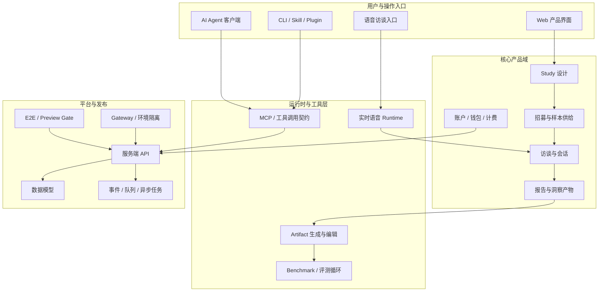

# 高层架构地图

这是公开版架构地图。它只描述产品域和系统职责，不包含私有仓库路径、内部 endpoint、文件级依赖或实现细节。

## 领域分层

## 关键链路

### Study -> Recruit -> Interview -> Report

这是研究产品的主链路。它要求业务实体、权限、参与者状态、访谈素材和报告产物保持一致。

### Agent -> MCP / CLI / Skill -> API

这是 AI 客户端进入产品的路径。重点不是“agent 会说什么”，而是 agent 能否通过稳定工具契约执行真实任务。

### Voice Runtime -> Interview State -> Report Evidence

语音层处理实时体验，但最终必须把访谈状态、素材和事实证据回到主业务系统。

### Report -> Artifact -> Evaluation

报告产物需要支持多格式交付、人工编辑、事实锁定和回归评测。否则生成质量难以长期提升。

### Preview / E2E / Release Gate

AI 产品链路长、状态多、环境复杂，发布验证必须覆盖真实路径，而不是只验证单个服务存活。

## 公开视角下的系统价值

- 将自然语言任务变成可执行产品 workflow
- 将实时语音体验纳入可追踪业务状态
- 将生成式报告纳入事实与质量控制
- 将 agent 接口、Web UI 和后端 API 保持在同一产品契约下
- 将复杂 AI 产品用 E2E 和发布闸稳定下来
