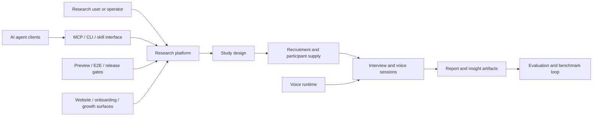

# AI Agent Product Engineering - Career Stage Summary

This repository is a public, sanitized career-stage summary of my work across an AI agent and user-research product platform.

It is intentionally not a source-code dump and not an internal architecture archive. The goal is to preserve the engineering lessons, system-shaping decisions, and cross-domain product thinking from this stage of work, while leaving out private code, customer data, internal paths, credentials, and low-level implementation details.

## Public Site

GitHub Pages:

`https://brickerp.github.io/ai-agent-career-stage-summary/`

This now opens an Understand-Anything style interactive dashboard, matching the local dashboard experience but backed by a sanitized public graph.

## What This Stage Was About

My work during this stage sat at the intersection of:

- AI-agent product workflows
- SaaS backend and frontend systems
- MCP, CLI, and skill/plugin based agent interfaces
- Voice-agent runtime and real-time session orchestration
- Report generation, evaluation, and quality loops
- E2E, preview, release, and deployment guardrails
- Research data pipelines and benchmark feedback

The main engineering theme was turning AI-agent workflows from demos into repeatable product systems: clear contracts, stable runtime boundaries, recoverable workflows, and measurable quality checks.

## System Shape

## Public Artifacts

- [Stage summary](SUMMARY.zh.md)
- [Architecture map](ARCHITECTURE_MAP.zh.md)
- [Public onboarding note](ONBOARDING.zh.md)
- [Sanitization notes](SECURITY_AND_SANITIZATION.md)
- [Understand-Anything dashboard build](docs/index.html)
- [Sanitized dashboard graph](docs/knowledge-graph.json)
- [Sanitized public domain map data](data/public-domain-map.json)

## What Is Not Published

This repository does not include:

- private source code
- complete private repository knowledge graphs
- internal file paths or symbol maps
- credentials, tokens, secrets, environment files, or service endpoints
- customer, participant, transcript, or interview data
- proprietary implementation details

The public dashboard graph keeps only high-level architecture and personal engineering reflection.

## License

Unless otherwise noted, the written content in this repository is released under CC BY 4.0. See [LICENSE.md](LICENSE.md).
